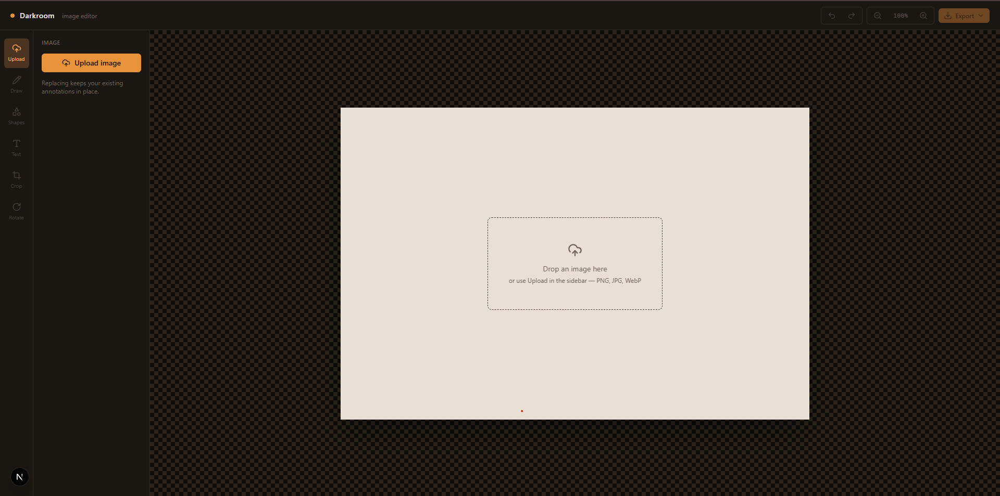
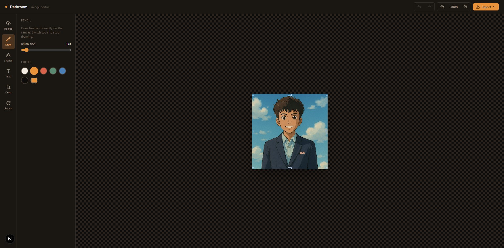
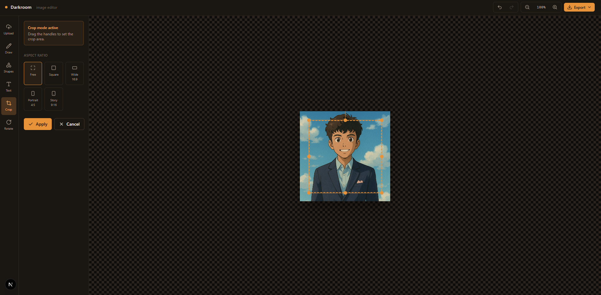
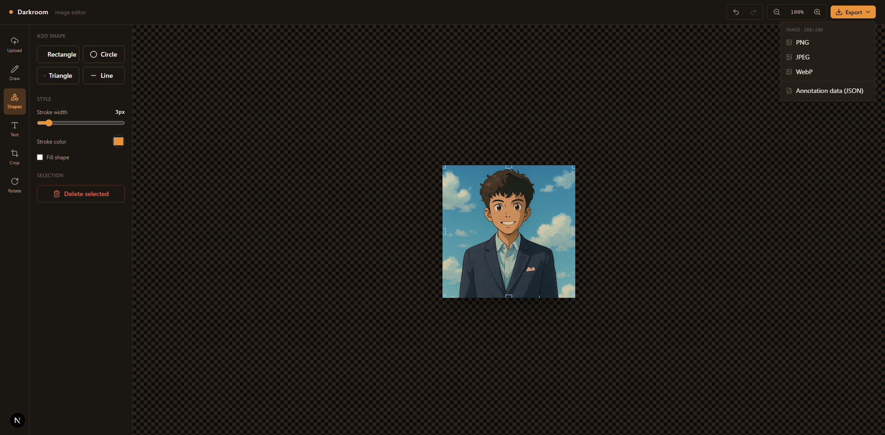

# Darkroom — Image Editor

> A browser-based image editor built as a MERN Stack Intern technical assignment for Optimum Output.
> Upload, annotate, crop, rotate, and export images — fully client-side, no backend required.

---

## 🎥 Demo

| | |
|---|---|
| **Live Demo** | 🔗 [Add your Vercel / Netlify link here](#) |
| **Walkthrough Video** | 🎬 [Add your Loom link here](#) |

---

## 📸 Screenshots

> _Add screenshots after running the app locally. Suggested shots: empty canvas, image uploaded with annotations, export menu open._

| Empty State | Editor with Annotations |
|---|---|
|  |  |

| Crop Mode | Export Menu |
|---|---|
|  |  |

---

## ✨ Features

| Feature | Details |
|---|---|
| **Upload** | Drag-and-drop or file picker · PNG / JPG / WebP · Re-upload replaces base image while keeping annotations |
| **Free Draw** | Freehand pencil with adjustable brush size and color picker |
| **Shapes** | Rectangle, circle, triangle, line — configurable stroke, fill, and width |
| **Text** | Add editable text boxes · font family, size, color, alignment, bold / italic / underline |
| **Crop** | Draggable overlay rectangle · free-form or locked aspect ratios (1:1, 16:9, 4:5, 9:16) |
| **Rotate** | 90° quick steps · horizontal & vertical flip · free-rotation slider |
| **Undo / Redo** | Debounced full-canvas snapshot history (up to 30 states) |
| **Zoom** | Zoom in/out with auto-fit-to-window on upload |
| **Export Image** | PNG / JPEG / WebP at full logical resolution |
| **Export JSON** | Annotation data + drawing data + image editing metadata in one structured file |

---

## 🧱 Tech Stack

- **Framework** — Next.js 16 (App Router)
- **Language** — TypeScript (strict, zero `any`)
- **Canvas** — Fabric.js v6
- **Styling** — Tailwind CSS v4
- **Icons** — lucide-react

---

## 🗂️ Project Structure (MVVM)

```
image-editor/
├── types/                    # Model — ToolId, EditorExport, ImageMeta, etc.
│
├── hooks/                    # ViewModel layer
│   ├── useFabricCanvas.ts    #   Canvas lifecycle, zoom, fit-to-container
│   ├── useHistory.ts         #   Undo/redo snapshot stack
│   └── useImageUpload.ts     #   File read → canvas place flow
│
├── context/
│   └── EditorContext.tsx     # Wires all hooks into one shared ViewModel
│
├── lib/
│   └── fabric-helpers.ts     # Pure-ish Fabric.js utilities (shapes, crop, export, rotate)
│
└── components/
    ├── editor/               # View layer
    │   ├── Editor.tsx        #   Root shell — composes all panels
    │   ├── Topbar.tsx        #   Undo/redo, zoom controls, export menu
    │   ├── Sidebar.tsx       #   Tool icon rail + active panel
    │   ├── CanvasStage.tsx   #   Fabric canvas mount, drag-drop, overlays
    │   └── tools/
    │       ├── UploadPanel.tsx
    │       ├── DrawPanel.tsx
    │       ├── ShapesPanel.tsx
    │       ├── TextPanel.tsx
    │       ├── CropPanel.tsx
    │       └── RotatePanel.tsx
    └── ui/                   # Shared primitives (Button, SliderRow, PanelSection)
```

**The rule:** components only render. Canvas mutations live in hooks and `lib/fabric-helpers.ts` so they can be reasoned about (and later tested) independently of React.

---

## 🚀 Setup & Run

Requires **Node.js 18.18+**. Check your version with `node -v`.

```bash
# 1. Clone the repo
git clone https://github.com/mohd-hassan17/Darkroom-image-editor.git
cd darkroom-image-editor

# 2. Install dependencies
npm install

# 3. Start the dev server
npm run dev
```

Open [http://localhost:3000](http://localhost:3000) in your browser.

### Other scripts

```bash
npm run build   # Production build (also runs TypeScript type-check)
npm run start   # Serve the production build
npm run lint    # ESLint
```

Both `lint` and `build` pass with zero errors/warnings.

---

## 📦 Export JSON Format

When you click **Export → Annotation data (JSON)**, you get a file shaped like this:

```json
{
  "version": 1,
  "image": {
    "fileName": "photo.png",
    "originalWidth": 1920,
    "originalHeight": 1080,
    "mimeType": "image/png",
    "uploadedAt": "2026-07-02T10:30:00.000Z"
  },
  "edit": {
    "rotationDegrees": 90,
    "cropApplied": true,
    "zoomLevel": 0.65,
    "lastModified": "2026-07-02T10:35:00.000Z"
  },
  "canvasObjects": {
    "objects": [ ...all paths, shapes, text objects... ]
  }
}
```

`canvasObjects` is Fabric.js's own serialization format — it contains every annotation object's position, style, and type, and can be loaded back into a canvas with `canvas.loadFromJSON()`.

---

## 🔑 Key Implementation Decisions

**Logical vs. display size**
The canvas's true pixel dimensions are fixed once from the uploaded image. Zoom is purely a display-time scale (`canvas.setZoom`) — object coordinates never change with window size. Export temporarily resets to 1:1 zoom, captures at full resolution, then restores the view.

**Undo / redo as a snapshot stack**
Full-canvas JSON snapshots rather than a command/diff pattern. Simpler to reason about and correct by construction — Fabric already serializes every object type in use, so there's nothing to miss.

**Crop mode derived from active tool**
`isCropMode` is not separate state — it's derived directly from `activeTool === "crop"`. One source of truth, no sync bugs.

**Fabric.js + React integration**
Fabric owns the canvas imperatively; React owns the UI. The boundary is `useFabricCanvas` — it creates the canvas once in a `useEffect`, exposes the instance via context, and every tool panel communicates with it through helper functions, not direct DOM access.

---

